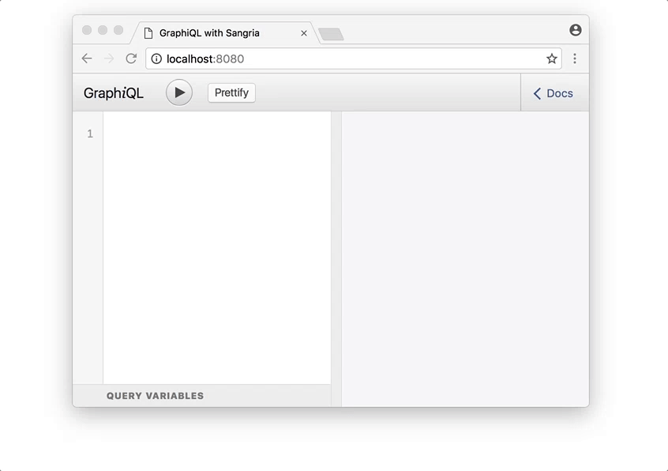

title: GraphQL + React
author:
  name: Raúl Hernández
  twitter: raulghm
  url: https://github.com/raulghm
output: index.html
controls: true
style: style.css
theme: juanbrujo/cleaver-beerjs

--

# GraphQL
## Como integrar con React

--

# ¿Por qué GraphQL?

--


--

# Since 2012 👶

<div class="u-alignCenter">
	Creado por Facebook el 2012. Uso interno y liberado en 2015.
</div>


--

# Core concepts 💚

--

# GraphQL is a query language for your API

> Server-side runtime for executing queries by using a type system you define for your data.

http://graphql.org
--

# GraphQL no es 🤔

* Un reemplazo al motor de base de datos
* Una nueva especificación para la DB
* No trata o respalda los datos
* No es mágico (es necesaria una implementacion server/client)

--

# Over-fetching / under-fetching 🔥

<div class="u-alignCenter">
  
</div>

--

# Ask for what you need, get exactly that ⁉️

<div class="u-alignCenter">
  
</div>

--

# Ventajas de GraphQL 👌

* Menos peticiones
* Control de los datos requeridos
* Mayor performance (server)
* Apps mas rapidas (client)

--

# The Schema Definition Language (SDL)
## Desde el servidor un esquema para definir los datos

User

```js
type User {
  name: String!
  posts: [Post!]! @relation(name: "PostOnUser")
}
```

Post

```js
type Post {
  title: String!
  user: User @relation(name: "PostOnUser")
}
```

--

# Query 📞
## Desde el cliente

Query

```js
{
  allUsers {
    name
  }
}
```

Response

```
{
  "allUsers": [
    { "name": "Raul" },
    { "name": "Gustavo" },
    { "name": "Pedro" }
  ]
}
```

--

# Mutation
## create

```
mutation {
  createUser(
  	name: "Jorge"
  ) {
    id
    name
  }
}
```

Response

```
{
	"createUser": {
      "id": "1",
      "name": "Jorge",
	}
}
```

--

# Apollo Client
## https://www.apollographql.com

> Sirve para integrar Graphql. Soporte para diferentes librerias y frameworks

* Vue-apollo
* React-apollo
* iOS
* Android
* React Native
* ...

--

# GraphQL + React = 💚

## Instalar con npm o yarn

```js
yarn add react-apollo
yarn add apollo-client
yarn add apollo-link-http
yarn add apollo-cache-inmemory
```

## Importar Apollo en React

```js
import { ApolloProvider } from 'react-apollo'
import { ApolloClient } from 'apollo-client'
import { HttpLink } from 'apollo-link-http'
import { InMemoryCache } from 'apollo-cache-inmemory'
```
--

# Show me the code

Proyecto base: https://github.com/raulghm/beerjs-valdivia-slides-02/tree/master/project

--

# Flujo para implementar GraphQL en el cliente

* Importar librearias Apollo
* Levantar una instancia de GraphQL (localhost), mas info: https://www.graph.cool/docs/quickstart/frontend/react/apollo-tijghei9go/
* Integrar endpoint `const httpLink = new HttpLink({ uri: '__SIMPLE_API_ENDPOINT__' })`
* Crear `query` y `mutation` para cada componente y pasar via props. (Revisar carpeta `/components`)

* Se utilizo este ejemplo para mostrar el funcionamiento en React: https://github.com/graphcool-examples/react-graphql/tree/master/quickstart-with-apollo
* Nota: Para la implementación del backend se utilizo graph.cool que se encarga 
de levantar las instancias y crear los types correspondientes. Revisar `/server/types.graphql` para ver el modelo.

--

# Resources

* http://graphql.org (web oficial)
* https://www.howtographql.com (tutorial)
* https://www.apollographql.com (web oficial apollo)
* https://graph.cool (Backend as a service)
* https://github.com/graphcool-examples (Ejemplos)